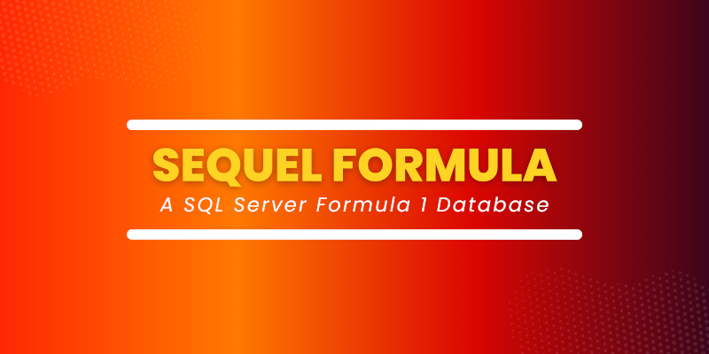

# F1 SQL Database
This repository holds the database schema used to build the F1 SQL database. 

This is currently under development in preparation for Ergast retiring the API at the end of the 2024 season.

F1 SQL is a Microsoft SQL Server database designed and developed using the freely available data from [Ergast API](https://ergast.com/mrd/) 

This project is maintained for education and demonstration purposes.

## Documentation

If you are looking for documentation that is available [here](https://f1-sql.com/)